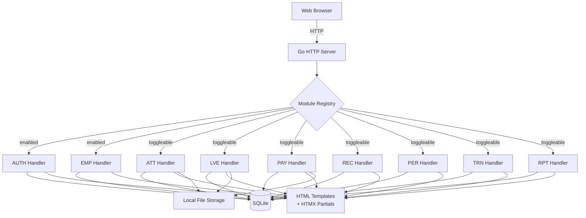
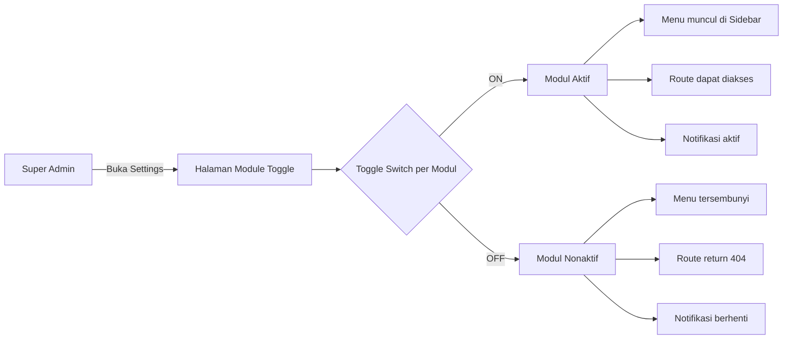
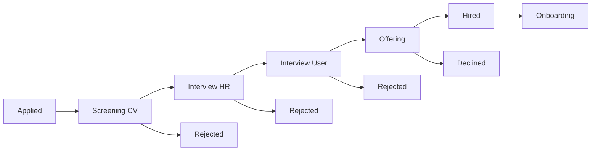
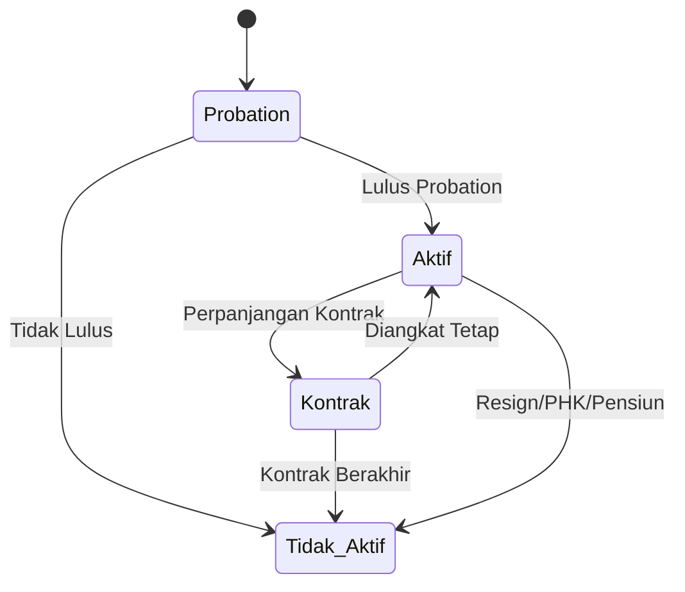
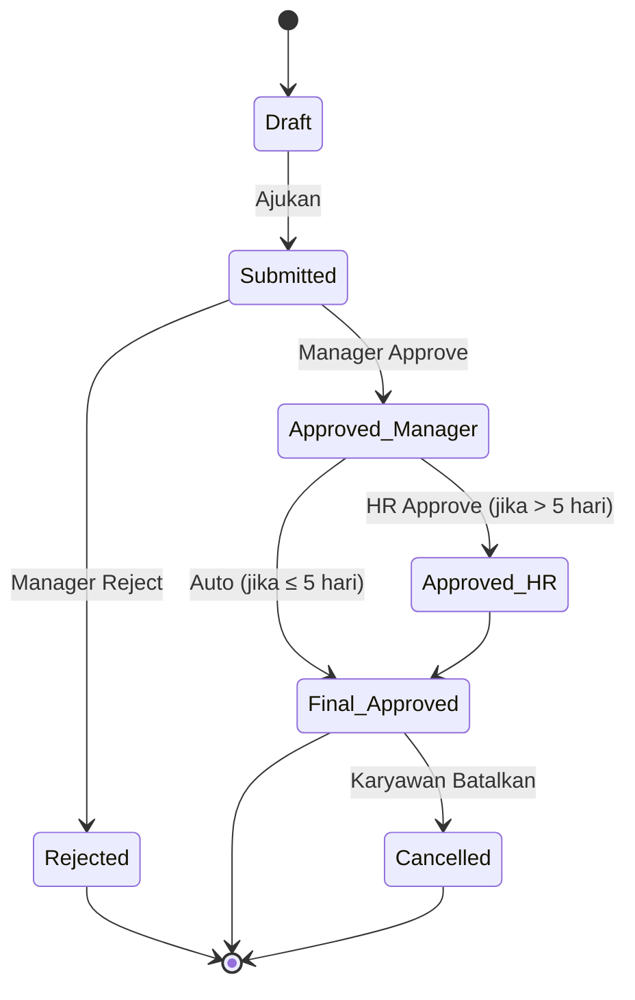
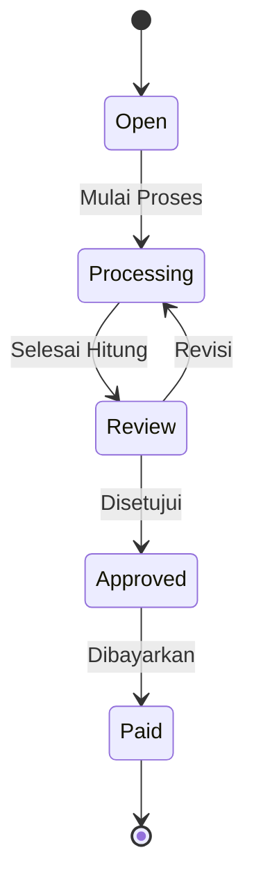

# Functional Requirements Document (FRD)
# Aplikasi HRD Web App

| **Dokumen**       | FRD – HRD Web Application           |
| ----------------- | ------------------------------------ |
| **Versi**         | 1.1                                 |
| **Tanggal**       | 30 Maret 2026                        |
| **Status**        | Draft (Revisi)                       |
| **Disiapkan oleh**| Tim Pengembangan                     |

---

## 1. Pendahuluan

### 1.1 Tujuan Dokumen
Dokumen ini menjelaskan kebutuhan fungsional dan non-fungsional dari Aplikasi HRD Web App. Aplikasi ini dirancang untuk mengelola seluruh proses Human Resource Department secara digital, mulai dari manajemen data karyawan, absensi, cuti, penggajian, rekrutmen, hingga pelaporan.

> [!IMPORTANT]
> Aplikasi ini di-deploy secara **lokal di PC/Laptop** (bukan cloud), menggunakan stack ringan (Go + SQLite), dan mendukung **sistem modular toggle** di mana setiap modul/menu dapat diaktifkan atau dinonaktifkan sesuai kebutuhan klien.

### 1.2 Ruang Lingkup
Aplikasi HRD Web App adalah platform berbasis web **single-binary** yang di-deploy lokal di PC/Laptop. Kapasitas dirancang untuk perusahaan dengan **maksimal 1.000 karyawan**. Aplikasi mencakup modul-modul berikut, yang semuanya dapat **diaktifkan/dinonaktifkan** melalui pengaturan sistem:

| # | Modul                        | Kode Modul | Default   | Toggleable |
|---|------------------------------|------------|-----------|:----------:|
| 0 | Konfigurasi Modul            | MOD        | ✅ Aktif  | ❌ (selalu aktif) |
| 1 | Autentikasi & Otorisasi      | AUTH       | ✅ Aktif  | ❌ (selalu aktif) |
| 2 | Manajemen Karyawan           | EMP        | ✅ Aktif  | ❌ (selalu aktif) |
| 3 | Absensi & Kehadiran          | ATT        | ✅ Aktif  | ✅ |
| 4 | Cuti & Izin                  | LVE        | ✅ Aktif  | ✅ |
| 5 | Payroll / Penggajian         | PAY        | ❌ Nonaktif| ✅ |
| 6 | Rekrutmen                    | REC        | ❌ Nonaktif| ✅ |
| 7 | Penilaian Kinerja            | PER        | ❌ Nonaktif| ✅ |
| 8 | Pelatihan & Pengembangan     | TRN        | ❌ Nonaktif| ✅ |
| 9 | Dashboard & Pelaporan        | RPT        | ✅ Aktif  | ✅ |

> [!NOTE]
> Modul AUTH, EMP, dan MOD adalah **modul inti** yang selalu aktif dan tidak dapat dinonaktifkan. Modul lain dapat di-toggle oleh Super Admin kapan saja. Modul yang dinonaktifkan akan tersembunyi dari sidebar menu dan tidak dapat diakses via URL.

### 1.3 Target Pengguna

| Role              | Deskripsi                                                        |
| ------------------ | ---------------------------------------------------------------- |
| **Super Admin**    | Akses penuh ke seluruh sistem, konfigurasi global                |
| **HR Admin**       | Mengelola data karyawan, absensi, cuti, payroll, rekrutmen       |
| **Manager**        | Menyetujui cuti, melihat laporan tim, penilaian kinerja          |
| **Karyawan**       | Akses self-service: profil, absensi, pengajuan cuti, slip gaji   |

### 1.4 Definisi & Istilah

| Istilah        | Definisi                                                          |
| -------------- | ----------------------------------------------------------------- |
| FRD            | Functional Requirements Document                                  |
| HRD            | Human Resource Department                                         |
| RBAC           | Role-Based Access Control                                         |
| Self-service   | Fitur yang memungkinkan karyawan mengelola data sendiri            |
| Payroll        | Proses penghitungan dan pembayaran gaji karyawan                  |
| KPI            | Key Performance Indicator                                         |

---

## 2. Arsitektur Umum Sistem

### 2.1 Model Deployment

Aplikasi di-deploy sebagai **single binary** di PC/Laptop lokal. Tidak memerlukan infrastruktur cloud, container, ataupun database server terpisah.

```
┌─────────────────────────────────────────────────┐
│                  PC / Laptop                     │
│                                                  │
│  ┌────────────────────────────────────────────┐  │
│  │         Go Binary (Single Process)         │  │
│  │                                            │  │
│  │  ┌──────────┐  ┌───────────────────────┐   │  │
│  │  │ HTTP     │  │ Module Registry       │   │  │
│  │  │ Server   │  │ (Toggle ON/OFF)       │   │  │
│  │  └────┬─────┘  └───────────────────────┘   │  │
│  │       │                                    │  │
│  │  ┌────┴─────────────────────────────────┐  │  │
│  │  │ Handlers (HTML Templates + HTMX)     │  │  │
│  │  │ AUTH | EMP | ATT | LVE | PAY | ...   │  │  │
│  │  └────┬─────────────────────────────────┘  │  │
│  │       │                                    │  │
│  │  ┌────┴──────┐  ┌──────────────────────┐   │  │
│  │  │ SQLite DB │  │ Local File Storage   │   │  │
│  │  │ (data.db) │  │ (./uploads/)         │   │  │
│  │  └───────────┘  └──────────────────────┘   │  │
│  └────────────────────────────────────────────┘  │
│                                                  │
│  Browser: http://localhost:8080                   │
└─────────────────────────────────────────────────┘
```

### 2.2 Diagram Arsitektur



### 2.3 Technology Stack

| Layer           | Teknologi                                                  |
| --------------- | ---------------------------------------------------------- |
| Frontend        | HTML5, HTMX, Tailwind CSS (CDN atau bundled)               |
| Templating      | Go html/template (server-side rendering)                   |
| Backend         | Go (net/http atau Chi/Echo router)                         |
| Database        | SQLite (via modernc.org/sqlite atau mattn/go-sqlite3)      |
| Authentication  | Session-based (cookie) + bcrypt password hashing           |
| File Storage    | Local filesystem (./uploads/)                              |
| Deployment      | Single binary, dijalankan langsung di PC/Laptop            |
| Build           | `go build` → 1 executable file                            |

> [!TIP]
> Dengan arsitektur ini, deployment cukup dengan **1 file executable + 1 file database (SQLite)**. Tidak perlu install database server, web server, atau dependency apapun di mesin klien.

---

## 3. Modul MOD – Konfigurasi Modul (Module Toggle)

### 3.1 Deskripsi
Modul inti yang mengelola pengaktifan dan penonaktifan modul-modul lain dalam sistem. Modul ini **selalu aktif** dan tidak dapat dinonaktifkan. Hanya Super Admin yang dapat mengubah konfigurasi modul.

### 3.2 Konsep Modular Toggle



### 3.3 Kebutuhan Fungsional

#### MOD-001: Daftar Modul & Status

| Item             | Detail                                                              |
| ---------------- | ------------------------------------------------------------------- |
| **Deskripsi**    | Menampilkan semua modul beserta status aktif/nonaktif                |
| **Aktor**        | Super Admin                                                          |
| **Fitur**        | - Daftar modul dengan toggle switch<br/>- Indikator modul inti (tidak bisa dimatikan)<br/>- Deskripsi singkat setiap modul<br/>- Jumlah data terkait modul (jika ada) |

#### MOD-002: Toggle Modul ON/OFF

| Item             | Detail                                                                     |
| ---------------- | -------------------------------------------------------------------------- |
| **Deskripsi**    | Mengaktifkan atau menonaktifkan modul                                       |
| **Aktor**        | Super Admin                                                                 |
| **Proses**       | 1. Klik toggle switch modul<br/>2. Konfirmasi dialog (terutama saat OFF)<br/>3. Update status modul di database<br/>4. Sidebar menu di-refresh otomatis (HTMX swap)<br/>5. Catat di audit log |
| **Aturan Bisnis**| - Modul AUTH, EMP, MOD tidak dapat dinonaktifkan<br/>- Menonaktifkan modul **tidak menghapus data**<br/>- Data tetap tersimpan dan dapat diakses kembali saat modul diaktifkan ulang<br/>- Perubahan berlaku langsung (real-time via HTMX) |

> [!WARNING]
> Menonaktifkan modul hanya menyembunyikan akses, **bukan menghapus data**. Semua data historis tetap aman di database dan akan kembali muncul saat modul diaktifkan kembali.

#### MOD-003: Dependency Antar Modul

| Modul   | Dependensi                        | Catatan                                         |
| ------- | --------------------------------- | ----------------------------------------------- |
| ATT     | —                                 | Berdiri sendiri                                  |
| LVE     | —                                 | Berdiri sendiri                                  |
| PAY     | ATT (opsional), LVE (opsional)    | Payroll lebih akurat jika ATT & LVE aktif        |
| REC     | —                                 | Berdiri sendiri                                  |
| PER     | —                                 | Berdiri sendiri                                  |
| TRN     | —                                 | Berdiri sendiri                                  |
| RPT     | Tergantung modul yang aktif       | Dashboard widget menyesuaikan modul yang enabled |

> [!NOTE]
> Jika modul PAY diaktifkan tanpa ATT, data kehadiran harus di-input manual di payroll. Sistem akan menampilkan warning pada halaman settings.

### 3.4 Implementasi Teknis

| Aspek                   | Implementasi                                                    |
| ----------------------- | --------------------------------------------------------------- |
| Storage                 | Tabel `modules` di SQLite (code, name, enabled, is_core)        |
| Middleware              | Go middleware yang cek status modul sebelum handle request       |
| Sidebar Menu            | Go template render sidebar berdasarkan modul yang enabled        |
| HTMX Integration        | Toggle switch menggunakan `hx-put` untuk update status real-time|
| Route Protection        | Middleware return 404 jika modul disabled                         |
| Cache                   | Status modul di-cache in-memory, invalidate saat toggle          |

---

## 4. Modul AUTH – Autentikasi & Otorisasi

### 3.1 Deskripsi
Modul autentikasi mengelola proses login, registrasi, dan kontrol akses berbasis role (RBAC) untuk seluruh pengguna sistem.

### 3.2 Kebutuhan Fungsional

#### AUTH-001: Login

| Item             | Detail                                                                     |
| ---------------- | -------------------------------------------------------------------------- |
| **Deskripsi**    | Pengguna dapat masuk ke sistem menggunakan username/email dan password       |
| **Aktor**        | Semua role                                                                  |
| **Pre-condition**| Akun pengguna sudah terdaftar di sistem                                     |
| **Input**        | Username atau Email, Password                                               |
| **Proses**       | 1. Validasi format input<br/>2. Verifikasi kredensial terhadap SQLite<br/>3. Buat session (cookie-based)<br/>4. Catat log login |
| **Output**       | Session cookie, Redirect ke Dashboard                                       |
| **Error**        | - Username/email tidak terdaftar<br/>- Password salah<br/>- Akun dinonaktifkan<br/>- Akun terkunci (5x gagal login) |

> [!IMPORTANT]
> Akun akan otomatis terkunci selama 30 menit setelah 5 kali percobaan login gagal berturut-turut.

#### AUTH-002: Logout

| Item             | Detail                                                             |
| ---------------- | ------------------------------------------------------------------ |
| **Deskripsi**    | Pengguna keluar dari sistem                                         |
| **Aktor**        | Semua role                                                          |
| **Proses**       | 1. Hapus session dari server & cookie<br/>2. Catat log logout       |
| **Output**       | Redirect ke halaman login                                           |

#### AUTH-003: Reset Password

| Item             | Detail                                                                         |
| ---------------- | ------------------------------------------------------------------------------ |
| **Deskripsi**    | Admin dapat mereset password karyawan, atau karyawan reset via Security Question |
| **Aktor**        | Super Admin, HR Admin (reset untuk karyawan), Karyawan (self-reset)              |
| **Proses**       | 1. Admin: pilih karyawan → reset ke password default → karyawan wajib ganti saat login berikutnya<br/>2. Self-reset: jawab security question → input password baru |
| **Aturan**       | Password minimal 8 karakter, mengandung huruf besar, huruf kecil, dan angka     |

> [!NOTE]
> Karena aplikasi berjalan lokal tanpa email server, fitur "Forgot Password via Email" diganti dengan mekanisme reset oleh Admin atau Security Question.

#### AUTH-004: Role-Based Access Control (RBAC)

| Item             | Detail                                                                     |
| ---------------- | -------------------------------------------------------------------------- |
| **Deskripsi**    | Sistem mengontrol akses fitur berdasarkan role pengguna                     |
| **Hak Akses**    | Ditentukan per modul dan per aksi (Create, Read, Update, Delete)            |

**Matriks Hak Akses:**

| Modul               | Super Admin | HR Admin | Manager | Karyawan |
| -------------------- | :---------: | :------: | :-----: | :------: |
| Konfigurasi Modul    | CRUD        | R        | —       | —        |
| Manajemen Karyawan   | CRUD        | CRUD     | R       | R (self) |
| Absensi              | CRUD        | CRUD     | R (tim) | CR (self)|
| Cuti & Izin          | CRUD        | CRUD     | RU (approve) | CR (self) |
| Payroll              | CRUD        | CRUD     | R (tim) | R (self) |
| Rekrutmen            | CRUD        | CRUD     | R       | —        |
| Penilaian Kinerja    | CRUD        | CRUD     | CRU     | R (self) |
| Pelatihan            | CRUD        | CRUD     | R       | R        |
| Dashboard & Laporan  | Full        | Full     | Tim     | Self     |
| Konfigurasi Sistem   | CRUD        | R        | —       | —        |

> [!NOTE]
> Matriks di atas hanya berlaku untuk modul yang **aktif (enabled)**. Modul yang dinonaktifkan tidak muncul di menu dan tidak dapat diakses oleh role manapun.

---

## 4. Modul EMP – Manajemen Karyawan

### 4.1 Deskripsi
Modul ini mengelola seluruh data karyawan termasuk informasi personal, data pekerjaan, dokumen, dan riwayat karir.

### 4.2 Kebutuhan Fungsional

#### EMP-001: Tambah Karyawan Baru

| Item             | Detail                                                                         |
| ---------------- | ------------------------------------------------------------------------------ |
| **Deskripsi**    | HR Admin dapat menambahkan data karyawan baru ke sistem                         |
| **Aktor**        | Super Admin, HR Admin                                                           |
| **Input**        | Data Personal, Data Pekerjaan, Data Kontak Darurat, Dokumen                     |
| **Proses**       | 1. Input data karyawan (multi-step form)<br/>2. Upload dokumen pendukung<br/>3. Generate NIK (Nomor Induk Karyawan)<br/>4. Buat akun user otomatis<br/>5. Kirim email kredensial awal |
| **Validasi**     | - NIK unik<br/>- Email unik<br/>- No. KTP unik<br/>- Format file dokumen (PDF, JPG, PNG) max 5MB |

**Data Karyawan yang Dikelola:**

```
├── Data Personal
│   ├── Nama Lengkap
│   ├── NIK Karyawan (auto-generated)
│   ├── No. KTP / NIK
│   ├── NPWP
│   ├── Tempat & Tanggal Lahir
│   ├── Jenis Kelamin
│   ├── Agama
│   ├── Status Perkawinan
│   ├── Alamat (KTP & Domisili)
│   ├── No. HP / Telepon
│   ├── Email Pribadi
│   ├── Email Kantor
│   └── Foto Profil
│
├── Data Pekerjaan
│   ├── Departemen
│   ├── Divisi
│   ├── Jabatan / Posisi
│   ├── Level / Grade
│   ├── Status Karyawan (Tetap / Kontrak / Probation / Magang)
│   ├── Tanggal Bergabung
│   ├── Tanggal Berakhir Kontrak
│   ├── Atasan Langsung (Manager)
│   └── Lokasi Kerja
│
├── Data Bank & Keuangan
│   ├── Nama Bank
│   ├── No. Rekening
│   ├── Atas Nama Rekening
│   ├── No. BPJS Ketenagakerjaan
│   └── No. BPJS Kesehatan
│
├── Kontak Darurat
│   ├── Nama
│   ├── Hubungan
│   └── No. Telepon
│
└── Dokumen
    ├── KTP
    ├── NPWP
    ├── Ijazah Terakhir
    ├── Surat Kontrak
    ├── BPJS
    └── Dokumen Lainnya
```

#### EMP-002: Edit Data Karyawan

| Item             | Detail                                                              |
| ---------------- | ------------------------------------------------------------------- |
| **Deskripsi**    | Memperbarui data karyawan yang sudah ada                             |
| **Aktor**        | Super Admin, HR Admin, Karyawan (data tertentu)                      |
| **Aturan**       | - Karyawan hanya bisa edit: foto, alamat domisili, no. HP, kontak darurat<br/>- Perubahan data pekerjaan hanya oleh HR Admin/Super Admin<br/>- Setiap perubahan tercatat di audit log |

#### EMP-003: Nonaktifkan / Resign Karyawan

| Item             | Detail                                                                     |
| ---------------- | -------------------------------------------------------------------------- |
| **Deskripsi**    | Proses offboarding karyawan yang resign, PHK, atau pensiun                  |
| **Aktor**        | Super Admin, HR Admin                                                       |
| **Proses**       | 1. Input alasan berhenti (resign/PHK/pensiun/meninggal)<br/>2. Input tanggal efektif<br/>3. Hitung sisa cuti & kompensasi<br/>4. Nonaktifkan akun user<br/>5. Tandai status karyawan sebagai "Tidak Aktif"<br/>6. Arsipkan data |

#### EMP-004: Daftar & Pencarian Karyawan

| Item             | Detail                                                                     |
| ---------------- | -------------------------------------------------------------------------- |
| **Deskripsi**    | Menampilkan daftar karyawan dengan fitur filter dan pencarian               |
| **Filter**       | Departemen, Divisi, Jabatan, Status, Lokasi, Tanggal Bergabung             |
| **Fitur**        | - Pencarian by nama / NIK<br/>- Sorting multi-kolom<br/>- Pagination<br/>- Export ke Excel/PDF |

#### EMP-005: Struktur Organisasi

| Item             | Detail                                                                     |
| ---------------- | -------------------------------------------------------------------------- |
| **Deskripsi**    | Menampilkan struktur organisasi perusahaan secara visual (org chart)         |
| **Fitur**        | - Visualisasi hierarki<br/>- Navigasi per departemen<br/>- Klik untuk detail karyawan |

---

## 5. Modul ATT – Absensi & Kehadiran

### 5.1 Deskripsi
Modul absensi mengelola pencatatan kehadiran karyawan, termasuk clock-in/out, perhitungan jam kerja, dan integrasi dengan mesin absensi.

### 5.2 Kebutuhan Fungsional

#### ATT-001: Clock In / Clock Out

| Item             | Detail                                                                         |
| ---------------- | ------------------------------------------------------------------------------ |
| **Deskripsi**    | Karyawan mencatat waktu masuk dan pulang kerja                                  |
| **Aktor**        | Karyawan                                                                        |
| **Metode**       | 1. Web (dengan geolocation)<br/>2. Mobile (GPS + selfie)<br/>3. Mesin fingerprint/face recognition |
| **Proses**       | 1. Karyawan klik "Clock In" / "Clock Out"<br/>2. Sistem ambil lokasi GPS & waktu server<br/>3. Validasi radius lokasi kantor (maks 100m)<br/>4. Simpan record kehadiran<br/>5. Hitung status (tepat waktu/terlambat/pulang cepat) |
| **Aturan Bisnis**| - Jam kerja default: 08:00 – 17:00 WIB<br/>- Toleransi keterlambatan: 15 menit<br/>- Pulang cepat: sebelum jam 16:30<br/>- Clock in hanya bisa dilakukan 1x per hari (kecuali dikonfigurasi) |

> [!NOTE]
> Radius validasi GPS dan jam kerja dapat dikonfigurasi oleh Super Admin melalui pengaturan sistem.

#### ATT-002: Rekap Kehadiran

| Item             | Detail                                                                     |
| ---------------- | -------------------------------------------------------------------------- |
| **Deskripsi**    | Menampilkan rekap kehadiran karyawan per periode                            |
| **Aktor**        | Semua role (sesuai scope masing-masing)                                     |
| **Fitur**        | - Kalender view (warna per status)<br/>- Tabel summary per bulan<br/>- Total hadir, terlambat, alpha, cuti, izin, sakit<br/>- Export ke Excel |

**Kode Warna Kalender:**

| Warna  | Status                |
| ------ | --------------------- |
| 🟢     | Hadir (tepat waktu)   |
| 🟡     | Hadir (terlambat)     |
| 🔴     | Alpha (tanpa keterangan) |
| 🔵     | Cuti                  |
| 🟣     | Izin / Sakit          |
| ⚪     | Hari libur / Weekend  |

#### ATT-003: Lembur (Overtime)

| Item             | Detail                                                                     |
| ---------------- | -------------------------------------------------------------------------- |
| **Deskripsi**    | Karyawan dapat mengajukan lembur yang harus disetujui atasan               |
| **Proses**       | 1. Karyawan ajukan form lembur (tanggal, jam mulai, jam selesai, alasan)<br/>2. Notifikasi ke Manager<br/>3. Manager approve/reject<br/>4. Jika approved, tercatat di payroll |
| **Aturan**       | - Lembur minimal 1 jam<br/>- Lembur hari kerja: 1.5x tarif per jam<br/>- Lembur hari libur: 2x tarif per jam<br/>- Maks lembur: 4 jam/hari, 18 jam/minggu |

#### ATT-004: Koreksi Absensi

| Item             | Detail                                                                     |
| ---------------- | -------------------------------------------------------------------------- |
| **Deskripsi**    | Karyawan dapat mengajukan koreksi data kehadiran (lupa clock in/out)        |
| **Proses**       | 1. Karyawan ajukan form koreksi dengan bukti<br/>2. HR Admin review & approve/reject<br/>3. Jika approved, data kehadiran diperbarui |

---

## 6. Modul LVE – Cuti & Izin

### 6.1 Deskripsi
Modul ini mengelola hak cuti karyawan, pengajuan cuti/izin, persetujuan, serta saldo cuti.

### 6.2 Kebutuhan Fungsional

#### LVE-001: Pengajuan Cuti

| Item             | Detail                                                                         |
| ---------------- | ------------------------------------------------------------------------------ |
| **Deskripsi**    | Karyawan dapat mengajukan cuti melalui sistem                                   |
| **Aktor**        | Karyawan                                                                        |
| **Input**        | Jenis cuti, Tanggal mulai, Tanggal selesai, Alasan, Lampiran (opsional)         |
| **Proses**       | 1. Pilih jenis cuti<br/>2. Pilih tanggal (kalender)<br/>3. Cek saldo cuti tersedia<br/>4. Cek tumpang tindih dengan cuti lain<br/>5. Submit pengajuan<br/>6. Notifikasi ke Manager<br/>7. Manager approve/reject<br/>8. Update saldo cuti |
| **Validasi**     | - Saldo cuti mencukupi<br/>- Tidak bentrok dengan cuti yang sudah disetujui<br/>- Pengajuan minimal H-3 (kecuali darurat) |

**Jenis-jenis Cuti:**

| Jenis Cuti            | Jatah/Tahun | Carry Over | Keterangan                              |
| --------------------- | :---------: | :--------: | --------------------------------------- |
| Cuti Tahunan          | 12 hari     | Maks 6 hari| Hak setelah 1 tahun bekerja             |
| Cuti Sakit            | Sesuai surat| —          | Wajib lampirkan surat dokter (>1 hari)  |
| Cuti Melahirkan       | 90 hari     | —          | Khusus karyawan wanita                  |
| Cuti Menikah          | 3 hari      | —          | Wajib lampirkan undangan                |
| Cuti Kematian Keluarga| 2 hari      | —          | Keluarga inti (orangtua, anak, pasangan)|
| Cuti Besar            | 30 hari     | —          | Setelah 6 tahun masa kerja              |
| Izin Tidak Berbayar   | Sesuai approval | —      | Dipotong gaji                           |

#### LVE-002: Approval Cuti

| Item             | Detail                                                              |
| ---------------- | ------------------------------------------------------------------- |
| **Deskripsi**    | Manager menyetujui atau menolak pengajuan cuti                       |
| **Aktor**        | Manager, HR Admin                                                    |
| **Proses**       | 1. Lihat daftar pengajuan pending<br/>2. Review detail pengajuan<br/>3. Approve / Reject (dengan catatan)<br/>4. Notifikasi ke karyawan<br/>5. Update saldo cuti (jika approved) |

> [!TIP]
> Sistem mendukung multi-level approval. Untuk cuti > 5 hari, persetujuan tambahan dari HR Admin diperlukan setelah Manager approve.

#### LVE-003: Saldo Cuti

| Item             | Detail                                                              |
| ---------------- | ------------------------------------------------------------------- |
| **Deskripsi**    | Menampilkan saldo cuti karyawan                                     |
| **Fitur**        | - Dashboard saldo per jenis cuti<br/>- Riwayat pemakaian cuti<br/>- Proyeksi carry over<br/>- Reset otomatis tiap awal tahun |

#### LVE-004: Kalender Cuti Tim

| Item             | Detail                                                              |
| ---------------- | ------------------------------------------------------------------- |
| **Deskripsi**    | Menampilkan kalender cuti seluruh anggota tim                        |
| **Aktor**        | Manager, HR Admin                                                    |
| **Fitur**        | - Timeline view per tim<br/>- Filter by departemen<br/>- Identifikasi konflik jadwal |

---

## 7. Modul PAY – Payroll / Penggajian

### 7.1 Deskripsi
Modul payroll mengelola perhitungan gaji, tunjangan, potongan, dan pembayaran gaji karyawan.

### 7.2 Kebutuhan Fungsional

#### PAY-001: Komponen Gaji

**Komponen Penghasilan:**

| Komponen               | Tipe        | Keterangan                              |
| ---------------------- | ----------- | --------------------------------------- |
| Gaji Pokok             | Tetap       | Berdasarkan grade/level                 |
| Tunjangan Jabatan      | Tetap       | Berdasarkan jabatan                     |
| Tunjangan Transport     | Tetap       | Berdasarkan level                       |
| Tunjangan Makan        | Variabel    | Berdasarkan kehadiran                   |
| Tunjangan Lembur       | Variabel    | Berdasarkan jam lembur approved         |
| Tunjangan Khusus       | Variabel    | THR, bonus, dll                         |

**Komponen Potongan:**

| Komponen                  | Tipe        | Keterangan                           |
| ------------------------- | ----------- | ------------------------------------ |
| PPh 21                    | Wajib       | Sesuai peraturan perpajakan          |
| BPJS Ketenagakerjaan      | Wajib       | JHT (2%), JP (1%), JKK, JKM         |
| BPJS Kesehatan            | Wajib       | 1% dari gaji pokok                   |
| Potongan Keterlambatan    | Variabel    | Berdasarkan konfigurasi              |
| Potongan Alpha            | Variabel    | 1/30 gaji pokok per hari             |
| Pinjaman Karyawan         | Variabel    | Cicilan pinjaman internal            |

#### PAY-002: Proses Penggajian (Payroll Run)

| Item             | Detail                                                                         |
| ---------------- | ------------------------------------------------------------------------------ |
| **Deskripsi**    | Proses perhitungan dan pembayaran gaji bulanan                                  |
| **Aktor**        | HR Admin                                                                        |
| **Proses**       | 1. Tentukan periode payroll (bulan/tahun)<br/>2. Tarik data kehadiran dari modul ATT<br/>3. Tarik data cuti dari modul LVE<br/>4. Tarik data lembur yang disetujui<br/>5. Hitung komponen penghasilan<br/>6. Hitung komponen potongan<br/>7. Hitung PPh 21<br/>8. Generate slip gaji<br/>9. Review & approval oleh Finance/Management<br/>10. Proses pembayaran<br/>11. Kirim slip gaji ke email karyawan |

> [!WARNING]
> Payroll run yang sudah difinalisasi dan dibayarkan tidak dapat diubah. Koreksi dilakukan melalui adjustment di periode berikutnya.

#### PAY-003: Slip Gaji

| Item             | Detail                                                              |
| ---------------- | ------------------------------------------------------------------- |
| **Deskripsi**    | Karyawan dapat melihat dan mengunduh slip gaji                       |
| **Aktor**        | Karyawan (self), HR Admin                                            |
| **Format**       | PDF (dapat diunduh dan dicetak)                                      |
| **Konten**       | Header perusahaan, data karyawan, rincian penghasilan, rincian potongan, gaji bersih, periode |
| **Keamanan**     | Dilindungi password (6 digit terakhir NIK karyawan)                  |

#### PAY-004: Laporan Pajak (PPh 21)

| Item             | Detail                                                              |
| ---------------- | ------------------------------------------------------------------- |
| **Deskripsi**    | Generate laporan pajak PPh 21 bulanan dan tahunan                    |
| **Fitur**        | - Bukti potong 1721-A1<br/>- SPT Masa PPh 21<br/>- Export format e-SPT |

---

## 8. Modul REC – Rekrutmen

### 8.1 Deskripsi
Modul rekrutmen mengelola proses perekrutan karyawan baru, mulai dari pembuatan lowongan hingga onboarding.

### 8.2 Kebutuhan Fungsional

#### REC-001: Manajemen Lowongan (Job Posting)

| Item             | Detail                                                                     |
| ---------------- | -------------------------------------------------------------------------- |
| **Deskripsi**    | HR Admin dapat membuat dan mengelola lowongan pekerjaan                     |
| **Input**        | Judul posisi, Departemen, Level, Deskripsi kerja, Kualifikasi, Gaji range (opsional), Deadline |
| **Status**       | Draft → Published → Closed → Filled                                        |
| **Fitur**        | - Publish ke halaman karir perusahaan<br/>- Template posisi<br/>- Duplikasi lowongan |

#### REC-002: Manajemen Kandidat

| Item             | Detail                                                                     |
| ---------------- | -------------------------------------------------------------------------- |
| **Deskripsi**    | Mengelola data pelamar dan proses seleksi                                   |
| **Pipeline**     | Applied → Screening → Interview HR → Interview User → Offering → Hired / Rejected |



| Tahap         | Aksi                                                              |
| ------------- | ----------------------------------------------------------------- |
| Applied       | Otomatis masuk saat pelamar submit formulir                        |
| Screening     | HR review CV, pindahkan ke tahap selanjutnya atau tolak            |
| Interview HR  | Jadwalkan interview, input hasil evaluasi                          |
| Interview User| Jadwalkan interview dengan hiring manager, input hasil evaluasi    |
| Offering      | Buat offering letter, kirim ke kandidat                            |
| Hired         | Kandidat terima offering → proses input data karyawan baru         |

#### REC-003: Halaman Karir (Career Page)

| Item             | Detail                                                              |
| ---------------- | ------------------------------------------------------------------- |
| **Deskripsi**    | Halaman publik yang menampilkan lowongan terbuka                     |
| **Fitur**        | - Daftar lowongan aktif<br/>- Formulir lamaran online<br/>- Upload CV (PDF, maks 5MB)<br/>- Notifikasi email konfirmasi |

---

## 9. Modul PER – Penilaian Kinerja

### 9.1 Deskripsi
Modul penilaian kinerja mengelola proses evaluasi performa karyawan secara periodik.

### 9.2 Kebutuhan Fungsional

#### PER-001: Pengaturan Periode Penilaian

| Item             | Detail                                                              |
| ---------------- | ------------------------------------------------------------------- |
| **Deskripsi**    | Menentukan periode dan parameter penilaian kinerja                   |
| **Aktor**        | HR Admin, Super Admin                                                |
| **Konfigurasi**  | - Periode penilaian (semester / tahunan)<br/>- Bobot penilaian per kategori<br/>- KPI template per jabatan<br/>- Skala penilaian |

#### PER-002: Self-Assessment

| Item             | Detail                                                              |
| ---------------- | ------------------------------------------------------------------- |
| **Deskripsi**    | Karyawan mengisi penilaian diri sendiri                              |
| **Aktor**        | Karyawan                                                             |
| **Proses**       | 1. Karyawan menerima notifikasi periode penilaian terbuka<br/>2. Isi form self-assessment<br/>3. Submit ke Manager |

#### PER-003: Penilaian oleh Atasan

| Item             | Detail                                                              |
| ---------------- | ------------------------------------------------------------------- |
| **Deskripsi**    | Manager memberikan penilaian terhadap karyawan timnya                |
| **Aktor**        | Manager                                                              |
| **Komponen**     | - KPI Achievement (bobot 60%)<br/>- Kompetensi (bobot 25%)<br/>- Culture & Values (bobot 15%) |
| **Skala Nilai**  | 1 (Sangat Kurang) – 5 (Sangat Baik)                                 |

**Rating Scale:**

| Nilai | Label            | Deskripsi                                  |
| :---: | ---------------- | ------------------------------------------ |
| 5     | Exceptional      | Melampaui ekspektasi secara konsisten       |
| 4     | Exceeds          | Melampaui ekspektasi di beberapa area       |
| 3     | Meets            | Memenuhi ekspektasi                         |
| 2     | Below            | Di bawah ekspektasi, perlu perbaikan        |
| 1     | Unsatisfactory   | Tidak memenuhi standar minimum              |

#### PER-004: Laporan Penilaian Kinerja

| Item             | Detail                                                              |
| ---------------- | ------------------------------------------------------------------- |
| **Deskripsi**    | Menampilkan hasil penilaian kinerja                                  |
| **Fitur**        | - Radar chart per karyawan<br/>- Perbandingan antar periode<br/>- Distribusi rating per departemen<br/>- 9-Box Grid view<br/>- Export ke PDF |

---

## 10. Modul TRN – Pelatihan & Pengembangan

### 10.1 Deskripsi
Modul ini mengelola program pelatihan dan pengembangan karyawan.

### 10.2 Kebutuhan Fungsional

#### TRN-001: Manajemen Program Pelatihan

| Item             | Detail                                                                     |
| ---------------- | -------------------------------------------------------------------------- |
| **Deskripsi**    | Membuat dan mengelola program pelatihan                                     |
| **Aktor**        | HR Admin                                                                    |
| **Input**        | Nama pelatihan, Kategori, Deskripsi, Trainer, Jadwal, Kapasitas, Lokasi     |
| **Status**       | Draft → Published → Ongoing → Completed                                    |

#### TRN-002: Pendaftaran Pelatihan

| Item             | Detail                                                              |
| ---------------- | ------------------------------------------------------------------- |
| **Deskripsi**    | Karyawan mendaftar program pelatihan                                 |
| **Proses**       | 1. Karyawan lihat katalog pelatihan<br/>2. Daftar pelatihan yang diinginkan<br/>3. Approval Manager (jika diperlukan)<br/>4. Konfirmasi keikutsertaan |

#### TRN-003: Evaluasi Pelatihan

| Item             | Detail                                                              |
| ---------------- | ------------------------------------------------------------------- |
| **Deskripsi**    | Evaluasi setelah pelatihan selesai                                   |
| **Komponen**     | - Feedback peserta (rating & komentar)<br/>- Nilai pre-test & post-test<br/>- Sertifikat digital (auto-generated) |

#### TRN-004: Riwayat Pelatihan Karyawan

| Item             | Detail                                                              |
| ---------------- | ------------------------------------------------------------------- |
| **Deskripsi**    | Menampilkan daftar pelatihan yang telah diikuti karyawan             |
| **Fitur**        | - Timeline pelatihan<br/>- Total jam pelatihan<br/>- Sertifikat yang diperoleh<br/>- Skill mapping |

---

## 11. Modul RPT – Dashboard & Pelaporan

### 11.1 Deskripsi
Modul dashboard dan pelaporan menyediakan visualisasi data dan laporan untuk pengambilan keputusan.

### 11.2 Kebutuhan Fungsional

#### RPT-001: Dashboard Utama

**Dashboard HR Admin / Super Admin:**

| Widget                     | Tipe Visualisasi | Deskripsi                                |
| -------------------------- | ---------------- | ---------------------------------------- |
| Total Karyawan             | Counter / Card   | Jumlah karyawan aktif, baru bulan ini     |
| Kehadiran Hari Ini         | Donut Chart      | Hadir, terlambat, tidak hadir, cuti       |
| Pengajuan Pending          | Table / Badge    | Cuti, lembur, koreksi yang belum diproses |
| Turnover Rate              | Line Chart       | Tren turnover per bulan (12 bulan)        |
| Headcount per Departemen   | Bar Chart        | Distribusi karyawan per departemen        |
| Upcoming Events            | Timeline         | Kontrak segera berakhir, ulang tahun      |
| Gender Ratio               | Pie Chart        | Komposisi karyawan per gender             |
| Status Karyawan            | Stacked Bar      | Tetap, kontrak, probation, magang         |

**Dashboard Karyawan:**

| Widget                   | Tipe Visualisasi | Deskripsi                                |
| ------------------------ | ---------------- | ---------------------------------------- |
| Saldo Cuti               | Card             | Sisa cuti per jenis                       |
| Kehadiran Bulan Ini      | Calendar         | Mini kalender status kehadiran            |
| Pengajuan Saya           | Table            | Status pengajuan cuti/lembur              |
| Slip Gaji Terakhir       | Card + Link      | Quick access ke slip gaji bulan terakhir  |
| Pengumuman               | List             | Info dan pengumuman terbaru               |

**Dashboard Manager:**

| Widget                   | Tipe Visualisasi | Deskripsi                                |
| ------------------------ | ---------------- | ---------------------------------------- |
| Tim Saya                 | Card Grid        | Anggota tim dengan status kehadiran hari ini |
| Approval Queue           | Table + Badge    | Pengajuan tim yang perlu diproses         |
| Kehadiran Tim            | Heatmap          | Rekap kehadiran tim per minggu            |
| Kinerja Tim              | Radar Chart      | Ringkasan penilaian kinerja tim           |

#### RPT-002: Laporan

| Kode Laporan | Nama Laporan                  | Format Export | Akses              |
| ------------ | ----------------------------- | ------------- | ------------------- |
| RPT-L01      | Laporan Kehadiran Bulanan     | Excel, PDF    | HR Admin, Manager   |
| RPT-L02      | Laporan Lembur Bulanan        | Excel, PDF    | HR Admin, Manager   |
| RPT-L03      | Laporan Cuti Tahunan          | Excel, PDF    | HR Admin            |
| RPT-L04      | Laporan Payroll Bulanan       | Excel, PDF    | HR Admin, Finance   |
| RPT-L05      | Laporan PPh 21                | Excel, e-SPT  | HR Admin, Finance   |
| RPT-L06      | Laporan Turnover              | Excel, PDF    | HR Admin, Management|
| RPT-L07      | Laporan Headcount             | Excel, PDF    | HR Admin, Management|
| RPT-L08      | Laporan Rekrutmen             | Excel, PDF    | HR Admin            |
| RPT-L09      | Laporan Penilaian Kinerja     | Excel, PDF    | HR Admin, Manager   |
| RPT-L10      | Laporan Pelatihan             | Excel, PDF    | HR Admin            |

---

## 12. Kebutuhan Non-Fungsional

### 12.1 Performa

| Parameter                   | Target                                            |
| --------------------------- | ------------------------------------------------- |
| Response time (page render) | ≤ 200ms (server-side render, lokal)               |
| Page load time              | ≤ 1 detik (lokal network)                         |
| Concurrent users            | 10–50 user simultan (skala lokal)                 |
| SQLite max DB size          | Hingga 1 GB (cukup untuk <1.000 karyawan)         |
| Startup time                | ≤ 3 detik dari executable dijalankan              |

### 12.2 Keamanan

| Aspek                    | Implementasi                                               |
| ------------------------ | ---------------------------------------------------------- |
| Autentikasi              | Session-based (secure cookie, HttpOnly, SameSite=Strict)   |
| Password                 | Bcrypt hashing, min 8 karakter, complexity rules            |
| Data Transmission        | HTTP (lokal); HTTPS opsional via reverse proxy              |
| Session                  | Auto-logout setelah 30 menit idle                           |
| Audit Trail              | Log semua aksi CRUD dengan timestamp, user, IP              |
| SQL Injection Prevention | Parameterized queries (database/sql)                        |
| XSS Protection           | Go html/template auto-escaping + CSP headers                |
| CSRF Protection          | Token-based CSRF protection (per form)                      |

### 12.3 Kompatibilitas

| Browser             | Versi Minimum          |
| ------------------- | ---------------------- |
| Google Chrome       | Versi terbaru - 2       |
| Mozilla Firefox     | Versi terbaru - 2       |
| Microsoft Edge      | Versi terbaru - 2       |

> [!NOTE]
> Aplikasi utamanya diakses via **desktop browser** di jaringan lokal. Layout responsif untuk tablet didukung namun bukan prioritas utama.

### 12.4 Kapasitas & Penyimpanan

| Aspek                  | Spesifikasi                                        |
| ---------------------- | -------------------------------------------------- |
| Kapasitas Data Karyawan| Hingga 1.000 karyawan aktif                         |
| Retensi Data           | Data aktif: unlimited; Data arsip/resign: 5 tahun   |
| File Storage           | Local filesystem (`./uploads/`)                     |
| Database               | Single SQLite file (`./data.db`)                    |
| Backup                 | Manual copy file `data.db` + folder `uploads/`      |

> [!TIP]
> Backup cukup dengan meng-copy 2 item: file `data.db` dan folder `uploads/`. Dapat di-automate dengan scheduled task OS.

### 12.5 Integrasi (Opsional – Future)

| Sistem Eksternal        | Metode Integrasi  | Deskripsi                          |
| ----------------------- | ----------------- | ---------------------------------- |
| e-SPT (DJP)            | File Export       | Export CSV sesuai format e-SPT      |
| Import Data             | CSV Import        | Bulk import karyawan dari Excel/CSV |
| SMTP (Opsional)         | SMTP config       | Jika klien punya email server lokal |

---

## 13. Alur Notifikasi

### 13.1 Channel Notifikasi

| Channel       | Penggunaan                                              |
| ------------- | ------------------------------------------------------- |
| In-App        | **Utama** – Semua notifikasi (bell icon + notification center) |
| SMTP (Opsional)| Jika dikonfigurasi – approval request, slip gaji       |

> [!NOTE]
> Karena aplikasi berjalan lokal, **In-App notification adalah channel utama**. Email hanya tersedia jika klien mengkonfigurasi SMTP server.

### 13.2 Event Notifikasi

| Event                              | Penerima          | Channel   | Modul Terkait |
| ---------------------------------- | ----------------- | --------- | :-----------: |
| Pengajuan cuti baru                | Manager           | In-App    | LVE           |
| Cuti disetujui/ditolak             | Karyawan          | In-App    | LVE           |
| Pengajuan lembur baru              | Manager           | In-App    | ATT           |
| Slip gaji tersedia                 | Karyawan          | In-App    | PAY           |
| Kontrak segera berakhir (30 hari)  | HR Admin          | In-App    | EMP           |
| Periode penilaian kinerja dibuka   | Semua             | In-App    | PER           |
| Karyawan baru bergabung            | Tim terkait       | In-App    | EMP           |
| Pelatihan tersedia                 | Target karyawan   | In-App    | TRN           |

> [!NOTE]
> Notifikasi hanya muncul untuk modul yang **aktif (enabled)**. Jika modul LVE dinonaktifkan, notifikasi terkait cuti tidak akan di-generate.

---

## 14. Wireframe & UI/UX Guidelines

### 14.1 Prinsip Desain

| Prinsip            | Deskripsi                                                   |
| ------------------ | ----------------------------------------------------------- |
| Clean & Modern     | Desain bersih dengan whitespace yang cukup                   |
| Consistent         | Komponen UI konsisten di seluruh aplikasi                    |
| Accessible         | WCAG 2.1 Level AA compliance                                |
| Responsive         | Adaptif untuk berbagai ukuran layar                          |
| Intuitive          | Navigasi mudah dipahami tanpa pelatihan khusus               |

### 14.2 Layout Utama

```
┌──────────────────────────────────────────────────────────┐
│  Logo    Search Bar          Notifications  Profile      │
├──────────┬───────────────────────────────────────────────┤
│          │                                               │
│  Sidebar │        Main Content Area (HTMX)               │
│  Menu    │                                               │
│  (dynamic│  ┌───────────────────────────────────────┐    │
│  based on│                                       │    │
│  enabled │         Page Content                  │    │
│  modules)│         (partial swap via HTMX)        │    │
│          │                                       │    │
│  • Dashboard                                     │    │
│  • Karyawan                                      │    │
│  • Absensi *                                     │    │
│  • Cuti *   │                                    │    │
│  • Payroll *│                                    │    │
│  • Laporan *└─────────────────────────────────────┘    │
│  • Setting  │                                               │
│          │  * = hanya muncul jika modul aktif              │
├──────────┴───────────────────────────────────────────────┤
│  Footer: © 2026 Company Name. v1.1                        │
└──────────────────────────────────────────────────────────┘
```

---

## 15. Milestone & Timeline (Estimasi)

| Phase | Milestone                            | Durasi       | Modul                        | Catatan                       |
| ----- | ------------------------------------ | ------------ | ---------------------------- | ----------------------------- |
| 1     | Foundation & Core + Module Toggle    | 4 minggu     | MOD, AUTH, EMP               | Pondasi SSR, HTMX, SQLite    |
| 2     | Attendance & Leave                   | 3 minggu     | ATT, LVE                    | Modul toggleable pertama      |
| 3     | Dashboard & Reporting                | 2 minggu     | RPT                          | Dashboard dinamis per modul   |
| 4     | Payroll                              | 4 minggu     | PAY                          | Default OFF                   |
| 5     | Recruitment & Performance            | 4 minggu     | REC, PER                    | Default OFF                   |
| 6     | Training                             | 2 minggu     | TRN                          | Default OFF                   |
| 7     | Testing & QA                         | 3 minggu     | ALL                          | Test toggle on/off semua modul|
| 8     | UAT & Deployment                     | 2 minggu     | ALL                          | Packaging single binary       |
|       | **Total Estimasi**                   | **~24 minggu**|                             |                               |

> [!IMPORTANT]
> Timeline di atas adalah estimasi kasar. Karena modul bersifat togglable, fase 4-6 bisa di-skip atau dijadwalkan ulang sesuai prioritas klien.

---

## 16. Lampiran

### 16.1 Daftar Status Flow

**Status Karyawan:**


**Status Pengajuan Cuti:**


**Status Payroll:**


### 16.2 Glosarium Route (High-Level)

Karena menggunakan **server-side rendering (Go template + HTMX)**, routing berbasis halaman HTML, bukan REST API murni. HTMX request menggunakan `hx-get` / `hx-post` untuk partial page swap.

| Method | Route                           | Modul | Deskripsi                    | HTMX Partial |
| ------ | ------------------------------- | ----- | ---------------------------- | :----------: |
| GET    | /login                          | AUTH  | Halaman login                | —            |
| POST   | /login                          | AUTH  | Proses login                 | —            |
| POST   | /logout                         | AUTH  | Proses logout                | —            |
| GET    | /dashboard                      | RPT   | Dashboard utama              | ✔            |
| GET    | /employees                      | EMP   | Daftar karyawan              | ✔            |
| GET    | /employees/new                  | EMP   | Form tambah karyawan         | ✔            |
| POST   | /employees                      | EMP   | Simpan karyawan baru         | ✔            |
| GET    | /employees/:id                  | EMP   | Detail karyawan              | ✔            |
| GET    | /employees/:id/edit             | EMP   | Form edit karyawan           | ✔            |
| PUT    | /employees/:id                  | EMP   | Update karyawan              | ✔            |
| POST   | /attendance/clock-in            | ATT   | Clock in                     | ✔            |
| POST   | /attendance/clock-out           | ATT   | Clock out                    | ✔            |
| GET    | /attendance/report              | ATT   | Rekap kehadiran              | ✔            |
| GET    | /leaves                         | LVE   | Daftar cuti                  | ✔            |
| POST   | /leaves                         | LVE   | Ajukan cuti                  | ✔            |
| PUT    | /leaves/:id/approve             | LVE   | Approve cuti                 | ✔            |
| PUT    | /leaves/:id/reject              | LVE   | Reject cuti                  | ✔            |
| GET    | /payroll                        | PAY   | Halaman payroll              | ✔            |
| POST   | /payroll/run                    | PAY   | Proses payroll               | ✔            |
| GET    | /payroll/slips/:id              | PAY   | Slip gaji (HTML/PDF)         | ✔            |
| GET    | /settings/modules               | MOD   | Halaman toggle modul         | ✔            |
| PUT    | /settings/modules/:code         | MOD   | Toggle modul on/off          | ✔            |
| GET    | /reports/:type                  | RPT   | Halaman laporan              | ✔            |

> [!NOTE]
> Semua route modul toggleable dilindungi oleh **module middleware**. Jika modul dinonaktifkan, request ke route terkait akan mengembalikan **HTTP 404** atau redirect ke dashboard.

---

> [!NOTE]
> Dokumen ini bersifat **living document** dan akan terus diperbarui sesuai dengan perkembangan kebutuhan dan temuan selama proses pengembangan. Setiap perubahan signifikan akan didokumentasikan dengan versi baru.

---

**Riwayat Perubahan Dokumen:**

| Versi | Tanggal        | Penulis            | Perubahan                                                                 |
| ----- | -------------- | ------------------ | ------------------------------------------------------------------------- |
| 1.0   | 30 Maret 2026  | Tim Pengembangan   | Dokumen awal                                                              |
| 1.1   | 30 Maret 2026  | Tim Pengembangan   | Revisi tech stack (Go+HTMX+Tailwind+SQLite), deployment lokal, session-based auth, sistem modular toggle, kapasitas <1000 karyawan |
